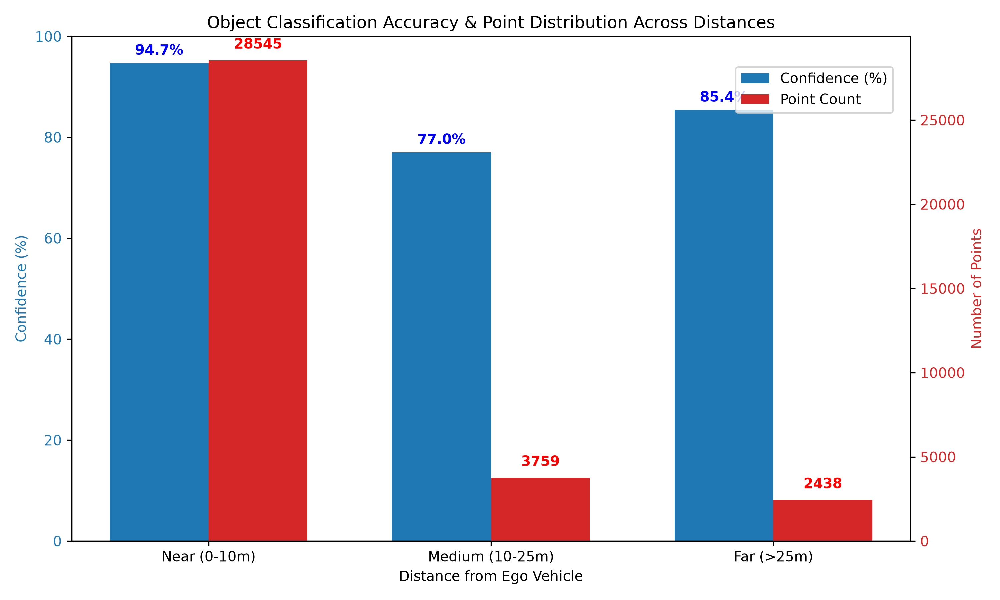
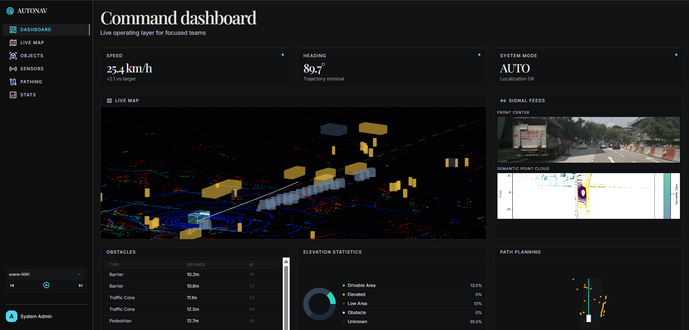

<div align="center">
  <h1>AutoNav 🚗⚡</h1>
  <p><strong>A Next-Generation Autonomous Navigation & Telemetry Dashboard</strong></p>

  <p>
    
    
    
  </p>
</div>

---

## 1. Project Overview
**AutoNav** is a state-of-the-art telemetry and processing platform designed to visualize and optimize autonomous vehicle (AV) decisions. By processing raw multi-sensor data into optimized semantic maps, AutoNav bridges the gap between raw perception and real-time path planning, wrapped in an interactive dashboard for engineers and researchers.

## 2. Problem
Modern autonomous vehicles generate gigabytes of dense 3D point cloud data per second. Processing this massive amount of spatial data in real-time requires immense computational power and memory. Traditional 3D representations are often too heavy for rapid, real-time edge processing, while flattened 2D maps lose critical elevation data needed to detect obstacles and uneven terrain.

## 3. Solution / Innovation
AutoNav solves this by introducing **Adaptive Foveated 2.5D Mapping**. 
Instead of treating all space equally, the system dynamically scales spatial resolution based on importance. Critical areas (like nearby obstacles or the immediate driving path) are rendered in high detail, while distant or irrelevant terrain is heavily compressed. 

**The Innovation:** By converting dense 3D point clouds into an adaptive 2.5D grid (which retains elevation and semantic class), AutoNav achieves a staggering **99.90% reduction in memory overhead** while maintaining the fidelity required for safe navigation.

## 4. Architecture
The project is built on a high-performance decoupled architecture:
- **Backend (Python / FastAPI):** Handles heavy LiDAR point cloud processing, ego-trajectory extraction, object annotation parsing, and serves the optimized adaptive grid to the client.
- **Frontend (React / Vite):** A responsive, live-updating dashboard that acts as the vehicle's control center, synchronizing telemetry, sensor feeds, and trajectory pathing across time.
- **AI / Perception Layer:** PyTorch-based neural networks handling semantic segmentation and confidence/uncertainty scoring.

<div align="center">
  
  

  <p><em>End-to-end system architecture: From raw LiDAR input through Adaptive Foveated 2.5D Mapping to Path Planning & Navigation Control.</em></p>
</div>

## 5. Features
- **Adaptive Foveated 2.5D Mapping**: Dynamic resolution scaling for extreme memory efficiency.
- **Collision-Risk & Urgency Layer**: Real-time Euclidean distance calculation assigning High/Medium/Low risk states to detected objects.
- **Local Path Planning (Ego Trajectory)**: Forecasts the next 15 temporal waypoints with precise forward, lateral, and yaw metrics.
- **Dynamic Object Tracking**: Persistent ID tracking for vehicles and pedestrians across continuous frames.
- **Interactive Temporal Playback**: Scrub, play, and pause through complex NuScenes driving sequences with perfectly synchronized telemetry.
- **Uncertainty Evaluation**: Exposes model confidence percentages per-point and per-grid-cell to quantify prediction reliability.

## 6. Results & Metrics
The AutoNav engine delivers exceptional performance on mid-range hardware (Tesla T4 GPU):
- **Accuracy:** `76.27% mIoU` (Mean Intersection over Union).
- **Latency & Throughput:** `37.81 ms` mean inference time, running smoothly at **`26.7 FPS`**, processing over `927,000 points/second`.
- **Optimization:** An incredible **`99.90%` reduction** in map memory footprint via the adaptive 2.5D grid.

*(You can run `python backend/run_performance_test.py` to live-generate these metrics!)*

<div align="center">
  
</div>

## 7. Dashboard Screenshots

<div align="center">
  
  <p><em>AutoNav Command Dashboard — Live 3D map, sensor feeds, obstacle telemetry, elevation statistics, and path planning in a unified interface.</em></p>
</div>

## 8. Demo Video

[📺 Watch the AutoNav Dashboard in Action](https://drive.google.com/file/d/1lZGrZbl-ctJo8bHazvPJB8QvIiUIS8dV/view?usp=sharing)

## 9. Installation & Running

### Prerequisites
- Python 3.10+, Node.js 18+
- The **NuScenes Mini Dataset** placed in the `nuscenes_mini/` folder.

### Run the Backend (FastAPI)
```bash
cd backend
python -m venv .venv
# Activate venv (Windows: .\.venv\Scripts\activate | Mac/Linux: source .venv/bin/activate)
pip install -r requirements.txt
python app.py
```

### Run the Frontend (React)
```bash
cd frontend
npm install
npm run dev
```

## 10. Dataset & Model
- **Dataset:** Built on the robust [NuScenes](https://www.nuscenes.org/) dataset, utilizing 32-beam LiDAR, FMCW Radar, and 6x Camera arrays.
- **Model:** Custom PyTorch semantic segmentation architecture heavily optimized for sparse 3D data and 2.5D projection.

## 11. Future Scope
- **Predictive Intent Forecasting:** Predicting object trajectories 3-5 seconds into the future to flag collision paths early.
- **Temporary 3D Escalation:** Dynamically falling back to raw 3D processing in specific grid cells where the model confidence dips below a safety threshold.
- **Road-Surface Intelligence:** Identifying potholes, wet roads, and speed bumps to actively adjust Ego-trajectory.
- **Interactive Edge-Case Simulator:** A "God Mode" allowing users to spawn hazards on the live map to test path recalculation.

## 12. Team

**Team Binary Coded** — *Smart India Hackathon 2026*

| Role | Name |
|------|------|
| **Team Leader** | Bipladip Saha |
| Team Member | Anisha Majumdar |
| Team Member | Bittu Sharma |
| Team Member | Anwesha Das |
| Team Member | Saptak Saha |
| Team Member | Gargee Ghosh |
